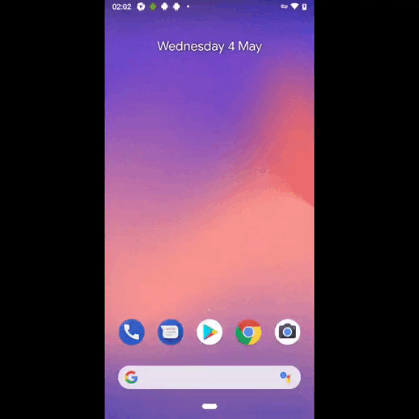

# Мобильная автоматизация тестирования Java+Appium

##  Видеоотчет прохождения теста на BrowserStack 
<p align="left">
  
</p>

Пример отчета [BrowserStack](https://app-automate.browserstack.com/builds/24b289c72cfb524a615158210ef883ff2b97cf11/sessions/3e2600e31475600b0d45416d0cabc7b8d8bfa11f?auth_token=2bdeb033605fe5cb997c1bb117345a56996bb6cab4ba10f5dde0580c79858bfd)

##  Видеоотчет прохождения теста на Emulator
<p align="left">
  
</p>


### Запуск тестов на эмуляторе

```bash
./gradlew clean selenide_android_test -Ddevice=emulation
```
## Конфигурационный файл emulation.properties
url=http://localhost:4723/wd/hub
appFileName=app-alpha-universal-release.apk
....

> <code>url</code> – адрес Allure Serve на локальной машине с портом (_например - <code>http://localhost:4723/wd/hub</code>_).
>
> <code>appFileName</code> - название дистрибутива приложения (_например - <code>app-alpha-universal-release.apk</code>_).
>
> <code>app</code> - адрес расположения дистрибутива приложения для скачивания (_например - <code>https://github.com/wikimedia/apps-android-wikipedia/releases/download/latest/app-alpha-universal-release.apk?raw=true</code>_).
>
> <code>deviceName</code> – название устройства на котором будут запускаться тесты (_например - <code>Pixel_4_API_30</code>_).
>
> <code>platformVersion</code> - версия, используемой платформы (_например - <code>11.0</code>_).
>
> <code>platformName</code> - название, используемой платформы (_например - <code>Android</code>_).
>
> <code>appPackage</code> - название пакета (_например - <code>org.wikipedia.alpha</code>_).
>
> <code>appActivity</code> - название "активности" (_например - <code>org.wikipedia.main.MainActivity</code>_).
>
> <code>locale</code> - используемый язык на локали (_например - <code>en</code>_).
>
><code>language</code> - язык для приложения (_наприме - <code>en</code>_).


### Запуск тестов на Browserstack

```bash
./gradlew clean selenide_android_test -Ddevice=browserstack
```

## Конфигурационный файл browserstack.properties
userName=testtesttesttest_TajXhK
accessKey=91v3WYYFHiexisvhqgR7
...

> <code>userName</code> – уникальное имя пользователя на BrowserStack (_например - <code>testtesttesttest_TajXhK</code>_).
>
> <code>accessKey</code> – ключ доступа пользователя (_например - <code>91v3WYYFHiexisvhqgR7</code>_).
>
> <code>url</code> – адрес среды запусков тестов BrowserStack (_например - <code>http://hub.browserstack.com/wd/hub</code>_).
>
> <code>appiumVersion</code> - используемая версия Appium (_например - <code>1.22.0</code>_).
>
> <code>deviceName</code> – название устройства на котором будут запускаться тесты (_например - <code>Google Pixel 3</code>_).
>
> <code>platformVersion</code> - версия, используемой платформы (_например - <code>9.0</code>_).
>
> <code>app</code> - уникальный адрес, загруженного приложения на BrowserStack (_например - <code>bs://2b384e7ff3f580c12db89e28227ac1a2c458b97c</code>_).
>
> <code>projectName</code> - наименование вашего проекта (_например - <code>Project BrowserStack</code>_).
>
> <code>buildName</code> - наименовае билда (_например - <code>Build 1</code>_).
>
><code>testName</code> - наименование теста (_наприме - <code>Test 1</code>_).


### Запуск тестов на реальном девайсе

```bash
./gradlew clean selenide_android_test -Ddevice=real
```

## Конфигурационный файл real.properties
deviceName=Pixel_4_API_30
appFileName=app-alpha-universal-release.apk
....

> <code>appFileName</code> - название дистрибутива приложения (_например - <code>app-alpha-universal-release.apk</code>_).
>
> <code>app</code> - адрес расположения дистрибутива приложения для скачивания (_например - <code>https://github.com/wikimedia/apps-android-wikipedia/releases/download/latest/app-alpha-universal-release.apk?raw=true</code>_).
>
> <code>deviceName</code> – название устройства на котором будут запускаться тесты (_например - <code>Pixel_4_API_30</code>_).
>
> <code>platformVersion</code> - версия, используемой платформы (_например - <code>11.0</code>_).
>
> <code>platformName</code> - название, используемой платформы (_например - <code>Android</code>_).
>
> <code>appPackage</code> - название пакета (_например - <code>org.wikipedia.alpha</code>_).
>
> <code>appActivity</code> - название "активности" (_например - <code>org.wikipedia.main.MainActivity</code>_).
>
> <code>locale</code> - используемый язык на локали (_например - <code>en</code>_).
>
><code>language</code> - язык для приложения (_наприме - <code>en</code>_).
>
> <code>url</code> – адрес Allure Serve на локальной машине с портом (_например - <code>http://localhost:4723/wd/hub</code>_).


### Запуск тестов через Selenoid
Стенд в процессе доработки.
